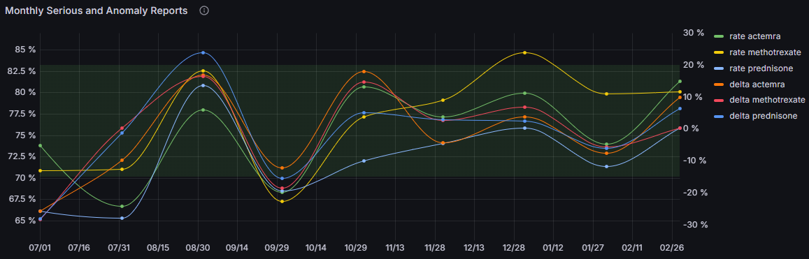

## Case Study 1: Drug Safety Signal Detection for Risk Management

### Business Impact
Early detection prevents costly recalls (average drug recall costs $100M+), protects brand reputation, and enables proactive regulatory communication.

### Question 1.1: Which three drugs have the highest volume of adverse event reports in the last 12 months?
**Purpose**: Identify drugs requiring immediate attention due to high report volume

```sql
SELECT 
  medicinal_product
  , COUNT(*) as total_reports
FROM 
    `ade-pipeline.ade_dev_core.patient_drug_reaction`
WHERE 
    -- Partitioned column
    record_date >= DATE_TRUNC(DATE_SUB(CURRENT_DATE(), INTERVAL 1 YEAR), YEAR)
    -- Filters
    AND medicinal_product IS NOT NULL
    AND fda_last_updated >= DATE_SUB(CURRENT_DATE(), INTERVAL 1 YEAR)
GROUP BY 
    medicinal_product
HAVING 
    total_reports >= 100
ORDER BY 
    total_reports DESC
LIMIT 3;
```


### Question 1.2: What percentage of reports are classified as serious (death and hospitalization) for each of the three high-volume (reports) drug?
**Purpose**: Assess severity patterns to prioritize safety investigations

```sql
WITH
event_reports AS (
  SELECT 
    medicinal_product
    , COUNT(*) AS total_reports
    , SUM(IF(serious_type IN ('Death', 'Hospitalization'), 1, 0)) AS serious_reports
    , ROUND(SUM(IF(serious_type IN ('Death', 'Hospitalization'), 1, 0)) * 100.0 / COUNT(*), 2) AS serious_rate
    , ROUND(SUM(IF(serious_type = 'Death', 1, 0)) * 100.0 / COUNT(*), 2) AS death_rate
    , ROUND(SUM(IF(serious_type = 'Hospitalization', 1, 0)) * 100.0 / COUNT(*), 2) AS hospitalization_rate
  FROM 
    `ade-pipeline.ade_dev_core.patient_drug_reaction`
  WHERE 
    record_date >= DATE_TRUNC(DATE_SUB(CURRENT_DATE(), INTERVAL 1 YEAR), YEAR)
    AND medicinal_product IS NOT NULL
    AND fda_last_updated >= CURRENT_DATE() - INTERVAL 1 YEAR
  GROUP BY 
    medicinal_product
  HAVING 
    total_reports >= 100
  ORDER BY 
    total_reports DESC, death_rate DESC, hospitalization_rate DESC
  LIMIT 3
)
SELECT
  medicinal_product
  , death_rate
  , hospitalization_rate
FROM event_reports
```


### Question 1.3: Are adverse event reports increasing over the months for each of the high-volume (reports) drugs?
**Purpose**: Detect emerging safety signals through trend analysis

```sql
WITH 
-- Fetch three drugs with high report volume
top_3 AS (
  SELECT 
    medicinal_product
    , COUNT(*) as total_reports
  FROM 
      `ade-pipeline.ade_dev_core.patient_drug_reaction`
  WHERE 
      record_date >= DATE_TRUNC(DATE_SUB(CURRENT_DATE(), INTERVAL 1 YEAR), YEAR)
      AND medicinal_product IS NOT NULL
      AND fda_last_updated >= CURRENT_DATE() - INTERVAL 1 YEAR
  GROUP BY 
      medicinal_product
  HAVING 
      total_reports >= 100
  ORDER BY 
      total_reports DESC
  LIMIT 3
)
-- Fetch monthly report count and monthly serious count for each of the three high-volume reports drugs
, monthly_reports AS (
  SELECT 
    medicinal_product
    , DATE_TRUNC(fda_last_updated, MONTH) AS fda_last_updated
    , COUNT(*) AS monthly_count
    , SUM(IF(serious_type IN ('Death', 'Hospitalization'),1,0)) AS monthly_serious
    , ROUND(SAFE_DIVIDE(100 * SUM(IF(serious_type IN ('Death', 'Hospitalization'),1,0)),COUNT(*)),2) AS serious_rate
  FROM 
    `ade-pipeline.ade_dev_core.patient_drug_reaction`
  WHERE 
    record_date >= DATE_TRUNC(DATE_SUB(CURRENT_DATE(), INTERVAL 1 YEAR), YEAR)
    AND medicinal_product IN (SELECT medicinal_product FROM top_3)
    AND fda_last_updated >= CURRENT_DATE() - INTERVAL 1 YEAR
  GROUP BY 
    1, 2
  HAVING
    monthly_count >= 100
    AND monthly_serious >= 50
)
-- Create Pivot table for the reports
SELECT 
  fda_last_updated
  , IFNULL(actemra, 0) AS actemra
  , IFNULL(methotrexate, 0) AS methotrexate
  , IFNULL(prednisone, 0) AS prednisone
FROM (
  SELECT 
    fda_last_updated
    , medicinal_product
    , serious_rate
  FROM monthly_reports
)
PIVOT (
  MAX(serious_rate)
  FOR medicinal_product IN ('actemra', 'methotrexate', 'prednisone')
)  
```



### Question 1.4: Detect unusually high rates of expedited reports among the high-volume drugs?
**Purpose**: Identify drugs with urgent safety concerns requiring immediate regulatory attention

```sql
WITH
-- Fetch reports associated with serious events and calculate percentage of expedited reports
reports AS (
  SELECT 
    medicinal_product
    , DATE_TRUNC(fda_last_updated, MONTH) AS fda_last_updated
    , COUNT(*) as total_reports
    , ROUND(SAFE_DIVIDE(
        SUM(IF(expedited_process = 'Yes' AND serious_type IN ('Death', 'Hospitalization'), 1, 0)) * 100.0,
        COUNT(*)
      ), 2) as expedited_rate
  FROM 
    `ade-pipeline.ade_dev_core.patient_drug_reaction`
  WHERE 
    record_date >= DATE_TRUNC(DATE_SUB(CURRENT_DATE(), INTERVAL 1 YEAR), YEAR)
    AND medicinal_product IN ('actemra', 'methotrexate', 'prednisone')
    AND fda_last_updated >= DATE_SUB(CURRENT_DATE(), INTERVAL 1 YEAR)
  GROUP BY 
    medicinal_product, fda_last_updated
  HAVING 
    total_reports >= 100
),
-- Stage table for observing trends in expedited rate
reports_with_lag AS (
  SELECT
    medicinal_product
    , fda_last_updated
    , expedited_rate
    , LAG(expedited_rate) OVER (PARTITION BY medicinal_product ORDER BY fda_last_updated) AS prev_expedited_rate
  FROM reports
),
-- Calculate change in expedited rate
delta_percent AS (
  SELECT
    medicinal_product
    , fda_last_updated
    , ROUND(
      SAFE_DIVIDE(
        (expedited_rate - prev_expedited_rate) * 100
        , prev_expedited_rate
      )
    , 2) AS expedited_rate_delta_percent
  FROM reports_with_lag
  WHERE prev_expedited_rate IS NOT NULL
)
-- Create Pivot table for the trend
SELECT
  fda_last_updated
  , IFNULL(actemra, 0) AS actemra
  , IFNULL(methotrexate, 0) AS methotrexate
  , IFNULL(prednisone, 0) AS prednisone
FROM (
  SELECT
    medicinal_product
    , fda_last_updated
    , expedited_rate_delta_percent
  FROM delta_percent
)
PIVOT (
  MAX(expedited_rate_delta_percent)
  FOR medicinal_product IN ('actemra', 'methotrexate', 'prednisone')
)
ORDER BY fda_last_updated ASC;
```


### Question 1.5: What are the three most common serious adverse reactions of the three high-volume drugs?
**Purpose**: Understand specific safety concerns to guide risk mitigation strategies

```sql
WITH
-- Fetch three drugs with high report volume
top_3 AS (
  SELECT 
    medicinal_product
    , COUNT(*) as total_reports
  FROM 
      `ade-pipeline.ade_dev_core.patient_drug_reaction`
  WHERE 
      record_date >= DATE_TRUNC(DATE_SUB(CURRENT_DATE(), INTERVAL 1 YEAR), YEAR)
      AND medicinal_product IS NOT NULL
      AND fda_last_updated >= CURRENT_DATE() - INTERVAL 1 YEAR
  GROUP BY 
      medicinal_product
  HAVING 
      total_reports >= 100
  ORDER BY 
      total_reports DESC
  LIMIT 3
)
-- Calculate serious reaction rate and count
, reports AS (
  SELECT 
    medicinal_product,
    patient_reaction,
    COUNT(*) as reaction_count,
    SUM(IF(serious_type IN ('Death', 'Hospitalization'), 1, 0)) as serious_reaction_count,
    ROUND((SUM(IF(serious_type IN ('Death', 'Hospitalization'), 1, 0)) * 100.0 / COUNT(*)), 2) as serious_reaction_rate
  FROM 
    `ade-pipeline.ade_dev_core.patient_drug_reaction`
  WHERE 
    record_date >= DATE_TRUNC(DATE_SUB(CURRENT_DATE(), INTERVAL 1 YEAR), YEAR)
    AND fda_last_updated >= DATE_SUB(CURRENT_DATE(), INTERVAL 1 YEAR)
    AND patient_reaction IS NOT NULL
    AND reaction_outcome IN ('Fatal')
    AND medicinal_product IN (SELECT medicinal_product FROM top_3)
  GROUP BY 
    medicinal_product, patient_reaction
  HAVING 
    reaction_count >= 50
  ORDER BY 
    medicinal_product, serious_reaction_rate DESC, reaction_count DESC
)
-- Rank serious reaction count and fetch the top 5 common reactions
, rank_reaction AS (
  SELECT 
    medicinal_product
    , patient_reaction
    , serious_reaction_count
    , RANK() OVER (PARTITION BY medicinal_product ORDER BY serious_reaction_count DESC) AS priority
  FROM
    reports
  WHERE
    serious_reaction_rate >= 95
)
SELECT 
  medicinal_product
  , patient_reaction
  , serious_reaction_count
FROM 
  rank_reaction 
WHERE 
  priority <= 5
```

