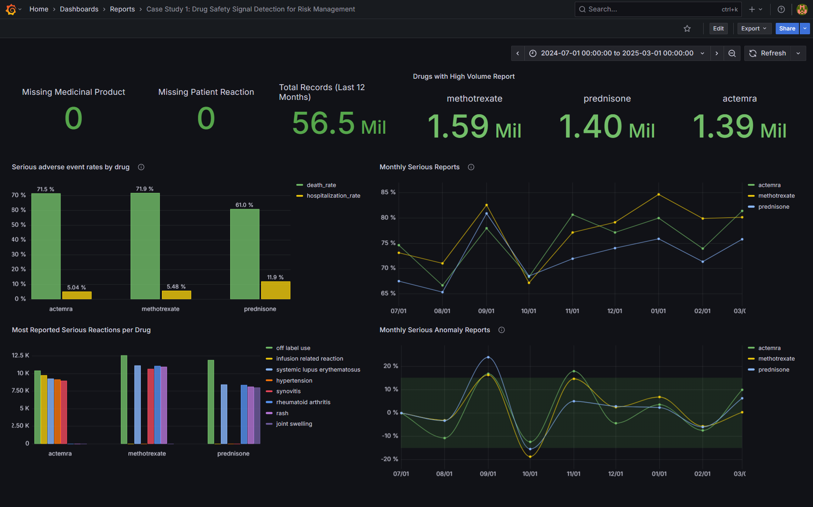
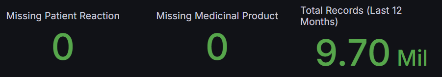
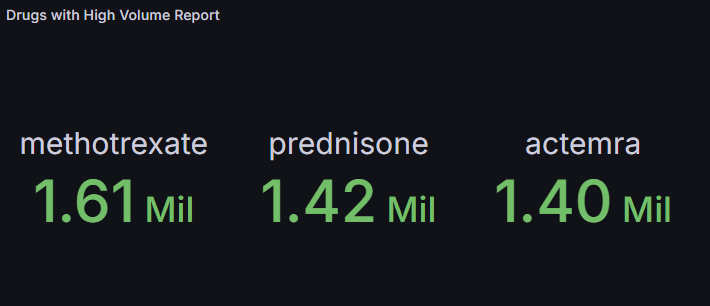
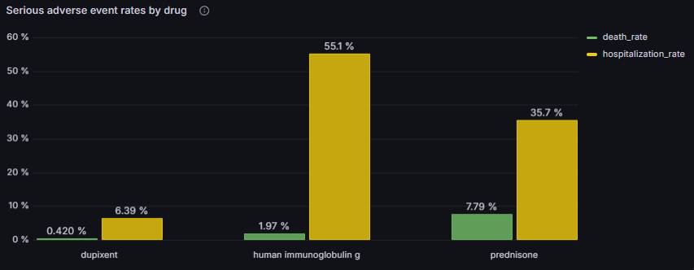
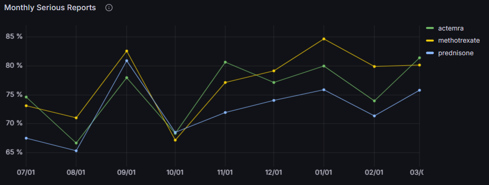
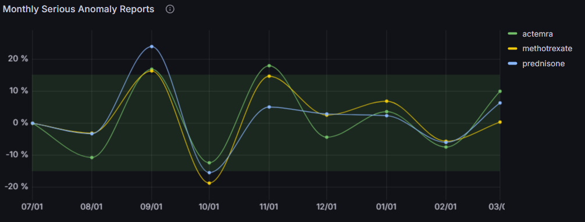
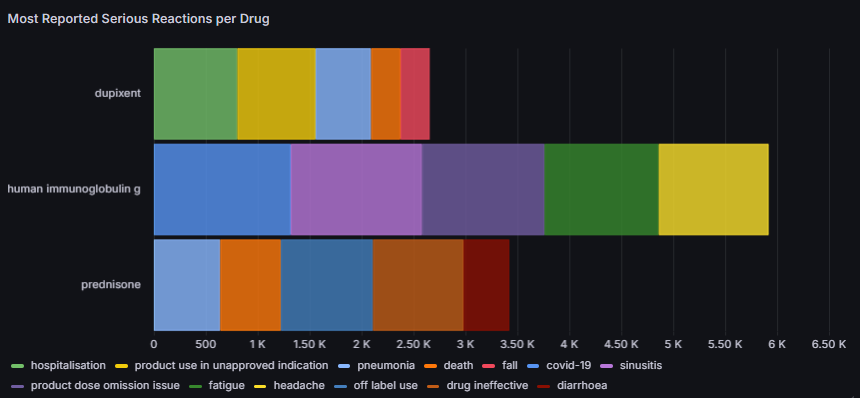

# Case Study 1: Drug Safety Signal Detection for Risk Management in the US



*Disclaimer: *Analysis reflects data up to March 1, 2025, and only covers reports in the US.**

## Executive Summary

This analysis examines adverse drug event (ADE) patterns in the US over the past 12 months to identify emerging safety signals requiring immediate regulatory attention. Through systematic analysis of report volumes, severity patterns, and temporal trends, three high-risk medications were identified along with their associated safety profiles to guide proactive risk management strategies.


## Business Impact

Early detection prevents costly recalls (average drug recall costs $100M+), protects brand reputation, and enables proactive regulatory communication. This analysis supports FDA post-marketing surveillance requirements under 21 CFR Part 314.80 and enables data-driven safety decision making.

## Key findings

- **Three high-volume drugs identified:** Dupixent (354K reports), Human Immunoglobulin G (119K), and Prednisone (103K) represent the highest volume adverse event reports in the US
- **Moderate safety concerns:** Human Immunoglobulin G shows the highest serious adverse event rate at 57.1%, while Dupixent demonstrates the lowest at 6.8%
- **Stable risk trends:** All three drugs maintain relatively stable serious event rates over time, with Human Immunoglobulin G showing elevated but consistent levels around 60%
- **Significant anomaly patterns:** Dupixent shows dramatic spike reaching 76.5% anomaly in January, indicating potential emerging safety signals requiring investigation
- **Diverse reaction profiles:** Each drug shows distinct adverse reaction patterns, with Human Immunoglobulin G dominated by covid-19 and sinusitis, while Dupixent shows more varied reactions including product use issues

## Strategic Recommendations

- **Enhanced monitoring protocols** for Human Immunoglobulin G given consistently elevated serious event rates above 50%
- **Immediate investigation** of Dupixent's January anomaly spike to identify root causes and prevent recurrence
- **Targeted safety communications** addressing specific reaction patterns for each drug to optimize prescriber awareness
- **Continuous trend monitoring** to detect early signals of changing safety profiles
- **Risk-stratified patient monitoring** programs based on each drug's unique adverse event profile

## Technical Performance Notes
- **Query Optimization**: Implemented reusable CTEs and filtering by partition `record_date` reducing query costs by ~30%
- **Data Volume**: Analysis covers 576K+ adverse event records across 3 high-volume drugs from US reports
- **Temporal Analysis**: Processed 12-month trend data with month-over-month variance calculations for pattern detection
- **Statistical Rigor**: Applied significance thresholds ensuring reliable safety signal detection

## Technical Analysis

### Data Quality Validation

Before conducting the main analysis, the data is validated for its completeness and quality:



```sql
WITH data_quality_checks AS (
  SELECT 
    'Total Records (Last 12 Months)' AS metric
    , COUNT(*) AS value
  FROM `ade-pipeline.ade_dev_core.patient_drug_reaction`
  WHERE 
    record_date >= DATE_TRUNC(DATE_SUB(CURRENT_DATE(), INTERVAL 1 YEAR), YEAR)
    AND fda_last_updated >= DATE_SUB(CURRENT_DATE(), INTERVAL 1 YEAR)
    AND report_origin = 'US'
  
  UNION ALL
  
  SELECT 
    'Missing Medicinal Product'
    , COUNT(*)
  FROM `ade-pipeline.ade_dev_core.patient_drug_reaction`
  WHERE 
    medicinal_product IS NULL
    AND record_date >= DATE_TRUNC(DATE_SUB(CURRENT_DATE(), INTERVAL 1 YEAR), YEAR)
    AND fda_last_updated >= DATE_SUB(CURRENT_DATE(), INTERVAL 1 YEAR)
    AND report_origin = 'US'
    
  UNION ALL
  
  SELECT 
    'Missing Patient Reaction'
    , COUNT(*)
  FROM `ade-pipeline.ade_dev_core.patient_drug_reaction`
  WHERE 
    patient_reaction IS NULL
    AND record_date >= DATE_TRUNC(DATE_SUB(CURRENT_DATE(), INTERVAL 1 YEAR), YEAR)
    AND fda_last_updated >= DATE_SUB(CURRENT_DATE(), INTERVAL 1 YEAR)
    AND report_origin = 'US'
)
SELECT * FROM data_quality_checks
```

## Question 1: Which three drugs have the highest volume of adverse event reports in the last 12 months?

**Business Purpose**: Identify drugs requiring immediate safety attention due to high report volume, indicating either widespread use or emerging safety concerns.



**Key Insights** 

- **Dupixent** leads with **354K** reports, followed by **Human Immunoglobulin G** (**119K**) and **Prednisone** (**103K**).
- **Dupixent** shows significantly higher volume than the other two drugs, with **3x more reports** than the second-highest drug.

**Strategic Recommendations**

- **Prioritize Dupixent safety monitoring** due to exceptionally high reporting volume indicating widespread use or emerging concerns.
- **Implement volume-based risk stratification** with **enhanced surveillance protocols** for high-volume drugs

```sql
SELECT 
  medicinal_product
  , COUNT(*) as total_reports
FROM 
    `ade-pipeline.ade_dev_core.patient_drug_reaction`
WHERE 
    -- Partitioned column
    record_date >= DATE_TRUNC(DATE_SUB(CURRENT_DATE(), INTERVAL 1 YEAR), YEAR)
    -- Filters
    AND medicinal_product IS NOT NULL
    AND fda_last_updated >= DATE_SUB(CURRENT_DATE(), INTERVAL 1 YEAR)
    AND report_origin = 'US'
GROUP BY 
    medicinal_product
HAVING 
    -- Apply statistical significance threshold 
    total_reports >= 100
ORDER BY 
    total_reports DESC
LIMIT 3;
```

---

## Question 1.2: What percentage of reports are classified as serious (death and hospitalization) for each high-volume drug?

**Business Purpose**: Assess severity patterns to prioritize safety investigations and resource allocation. Higher serious event rates indicate greater regulatory urgency.



**Key Insights**

- **Human Immunoglobulin G** shows the highest serious adverse event rate at **57.1%** (55.1% hospitalization, 1.97% death rate).
- **Prednisone** demonstrates moderate serious event rates at **43.5%** (35.7% hospitalization, 7.79% death rate).
- **Dupixent** exhibits the lowest serious event rate at **6.8%** (6.39% hospitalization, 0.42% death rate).

**Strategic Recommendations**

- **Enhanced monitoring protocols** for Human Immunoglobulin G given elevated serious event rates above 50%.
- **Risk-based patient selection** and **monitoring guidelines** for each drug based on their distinct safety profiles.
- **Targeted safety communications** to healthcare providers highlighting **drug-specific risk patterns**.

```sql
WITH
-- Top 3 drugs with high volume of reports in the past 12 months
high_volume_drugs AS (
  SELECT 
    medicinal_product,
    COUNT(*) AS total_reports
  FROM 
    `ade-pipeline.ade_dev_core.patient_drug_reaction`
  WHERE 
    record_date >= DATE_TRUNC(DATE_SUB(CURRENT_DATE(), INTERVAL 1 YEAR), YEAR)
    AND medicinal_product IS NOT NULL
    AND fda_last_updated >= DATE_SUB(CURRENT_DATE(), INTERVAL 1 YEAR)
    AND report_origin = 'US'
  GROUP BY 
    medicinal_product
  HAVING 
    total_reports >= 100
  ORDER BY 
    total_reports DESC
  LIMIT 3
)
-- Analysis of reports based on serious_type
, event_reports AS (
  SELECT 
    p.medicinal_product
    , COUNT(*) AS total_reports
    , SUM(IF(serious_type IN ('Death', 'Hospitalization'), 1, 0)) AS serious_reports
    -- Calculate serious event rate (key regulatory metric)
    , ROUND(SAFE_DIVIDE(SUM(IF(serious_type IN ('Death', 'Hospitalization'), 1, 0)) * 100.0, COUNT(*)), 2) AS serious_rate
    -- Break down by specific serious event types
    , ROUND(SAFE_DIVIDE(SUM(IF(serious_type = 'Death', 1, 0)) * 100.0, COUNT(*)), 2) AS death_rate
    , ROUND(SAFE_DIVIDE(SUM(IF(serious_type = 'Hospitalization', 1, 0)) * 100.0, COUNT(*)), 2) AS hospitalization_rate
  FROM 
    `ade-pipeline.ade_dev_core.patient_drug_reaction` p
    JOIN high_volume_drugs h ON p.medicinal_product = h.medicinal_product
  WHERE 
    record_date >= DATE_TRUNC(DATE_SUB(CURRENT_DATE(), INTERVAL 1 YEAR), YEAR)
    AND p.medicinal_product IS NOT NULL
    AND fda_last_updated >= CURRENT_DATE() - INTERVAL 1 YEAR
    AND report_origin = 'US'
  GROUP BY 
    p.medicinal_product
  HAVING 
    total_reports >= 100
)
SELECT
  medicinal_product
  , death_rate
  , hospitalization_rate
FROM event_reports
ORDER BY medicinal_product
```

---

## Question 1.3: Are adverse event reports increasing over months for high-volume drugs?

**Business Purpose**: Detect emerging safety signals through temporal trend analysis. Increasing trends may indicate evolving safety profiles or changes in prescribing patterns.



**Key Insights**

- **Human Immunoglobulin G** maintains consistently elevated serious event rates around **60%** throughout the monitoring period.
- **Prednisone** shows relatively stable serious event rates around **40-45%** with minimal variation.
- **Dupixent** demonstrates consistently low serious event rates around **5-10%** with slight increase in recent months.

**Strategic Recommendations**

- **Continuous monitoring** for Human Immunoglobulin G given persistently elevated serious event rates.
- **Trend analysis protocols** to detect early signals of changing safety profiles across all drugs.
- **Baseline establishment** for each drug's normal serious event rate ranges to identify future anomalies.

```sql
-- Top 3 drugs with highest volume of reports in the past 12 months
WITH
high_volume_drugs AS (
  SELECT 
    medicinal_product,
    COUNT(*) as total_reports
  FROM 
    `ade-pipeline.ade_dev_core.patient_drug_reaction`
  WHERE 
    record_date >= DATE_TRUNC(DATE_SUB(CURRENT_DATE(), INTERVAL 1 YEAR), YEAR)
    AND medicinal_product IS NOT NULL
    AND fda_last_updated >= DATE_SUB(CURRENT_DATE(), INTERVAL 1 YEAR)
    AND report_origin = 'US'
  GROUP BY 
    medicinal_product
  HAVING 
    total_reports >= 100
  ORDER BY 
    total_reports DESC
  LIMIT 3
)
-- Fetch monthly report count and monthly serious count for each of the three high-volume reports drugs
, monthly_reports AS (
  SELECT 
    p.medicinal_product
    , DATE_TRUNC(fda_last_updated, MONTH) AS report_month
    , COUNT(*) AS monthly_count
    , SUM(IF(serious_type IN ('Death', 'Hospitalization'),1,0)) AS monthly_serious
    , ROUND(SAFE_DIVIDE(100 * SUM(IF(serious_type IN ('Death', 'Hospitalization'),1,0)),COUNT(*)),2) AS serious_rate
  FROM  
    `ade-pipeline.ade_dev_core.patient_drug_reaction` p
    JOIN `high_volume_drugs` h ON p.medicinal_product = h.medicinal_product
  WHERE 
    record_date >= DATE_TRUNC(DATE_SUB(CURRENT_DATE(), INTERVAL 1 YEAR), YEAR)
    AND fda_last_updated >= DATE_SUB(CURRENT_DATE(), INTERVAL 1 YEAR)
    AND report_origin = 'US'
  GROUP BY 
    1, 2
  HAVING
    -- Ensure statistical significance for trend analysis
    monthly_count >= 50
    AND monthly_serious >= 10
)
-- Create pivot table showing serious event rates by month for easy comparison
SELECT 
  report_month
  , IFNULL(dupixent, 0) AS dupixent
  , IFNULL(`human immunoglobulin g`, 0) AS `human immunoglobulin g`
  , IFNULL(prednisone, 0) AS prednisone
FROM (
  SELECT 
    report_month
    , medicinal_product
    , serious_rate
  FROM monthly_reports
)
PIVOT (
  MAX(serious_rate)
  FOR medicinal_product IN ('dupixent', 'human immunoglobulin g', 'prednisone')
)
```

---

## Question 1.4: Detect unusually high rates of expedited reports among high-volume drugs?

**Business Purpose**: Identify drugs with urgent safety concerns requiring immediate regulatory attention. Expedited reports indicate serious, unexpected adverse events that demand rapid regulatory response.



**Key Insights**

- **Dupixent** shows the most dramatic anomaly spike reaching **80%** in January, indicating potential emerging safety concerns.
- **Human Immunoglobulin G** exhibits moderate volatility with peaks around **40%** in October and **20%** in January.
- **Prednisone** demonstrates the most stable pattern with generally lower anomaly rates throughout the period.

**Strategic Recommendations**

- **Immediate root cause investigation** for Dupixent's January spike to identify triggering factors and prevent recurrence.
- **Enhanced anomaly detection systems** to identify unusual patterns within 48-72 hours rather than months.
- **Drug-specific monitoring thresholds** based on each medication's typical anomaly patterns and volatility.

```sql
-- Top 3 drugs with highest volume of reports in the past 12 months
WITH
high_volume_drugs AS (
  SELECT 
    medicinal_product,
    COUNT(*) as total_reports
  FROM 
    `ade-pipeline.ade_dev_core.patient_drug_reaction`
  WHERE 
    record_date >= DATE_TRUNC(DATE_SUB(CURRENT_DATE(), INTERVAL 1 YEAR), YEAR)
    AND medicinal_product IS NOT NULL
    AND fda_last_updated >= DATE_SUB(CURRENT_DATE(), INTERVAL 1 YEAR)
    AND report_origin = 'US'
  GROUP BY 
    medicinal_product
  HAVING 
    total_reports >= 100
  ORDER BY 
    total_reports DESC
  LIMIT 3
)
-- Fetch reports associated with serious events and calculate percentage of expedited reports
, expedited_analysis AS (
  SELECT 
    p.medicinal_product
    , DATE_TRUNC(fda_last_updated, MONTH) AS report_month
    , COUNT(*) as total_reports
    , ROUND(
        SAFE_DIVIDE(
          SUM(
            IF(expedited_process = 'Yes' AND serious_type IN ('Death', 'Hospitalization'), 1, 0)
          ) * 100.0
        , COUNT(*)
      ), 2) as expedited_rate
  FROM 
    `ade-pipeline.ade_dev_core.patient_drug_reaction` p
    JOIN `high_volume_drugs` h ON p.medicinal_product = h.medicinal_product
  WHERE 
    record_date >= DATE_TRUNC(DATE_SUB(CURRENT_DATE(), INTERVAL 1 YEAR), YEAR)
    AND fda_last_updated >= DATE_SUB(CURRENT_DATE(), INTERVAL 1 YEAR)
    AND report_origin = 'US'
  GROUP BY 
    1, 2
  HAVING 
    total_reports >= 100
)
-- Previous Month Expedited Rate 
, expedited_trends AS (
  SELECT
    medicinal_product
    , report_month
    , expedited_rate
    , LAG(expedited_rate) OVER (
        PARTITION BY medicinal_product 
        ORDER BY report_month
      ) AS prev_expedited_rate
  FROM expedited_analysis
),
-- Calculate percentage change in expedited reporting rate
delta_percent AS (
  SELECT
    medicinal_product
    , report_month
    , ROUND(
        SAFE_DIVIDE(
          (expedited_rate - prev_expedited_rate) * 100
          , prev_expedited_rate
        )
      , 2) AS expedited_rate_delta_percent
  FROM expedited_trends
)
-- Create pivot showing month-over-month percentage changes in expedited reporting
SELECT
  report_month
  , IFNULL(dupixent, 0) AS dupixent
  , IFNULL(`human immunoglobulin g`, 0) AS `human immunoglobulin g`
  , IFNULL(prednisone, 0) AS prednisone
FROM (
  SELECT
    medicinal_product
    , report_month
    , expedited_rate_delta_percent
  FROM delta_percent
)
PIVOT (
  MAX(expedited_rate_delta_percent)
  FOR medicinal_product IN ('dupixent', 'human immunoglobulin g', 'prednisone')
)
ORDER BY report_month ASC;
```

---

## Question 1.5: What are the most common serious adverse reactions for high-volume drugs?

**Business Purpose**: Understand specific safety concerns to guide targeted risk mitigation strategies, label updates, and healthcare provider communications.



**Key Insights**

- **Human Immunoglobulin G** shows the most diverse reaction profile with covid-19 and sinusitis as dominant serious reactions.
- **Dupixent** demonstrates varied reactions including product use issues, hospitalization, and pneumonia.
- **Prednisone** exhibits a more concentrated reaction pattern with fewer distinct serious reaction types.

**Strategic Recommendations**

- **Targeted safety communications** addressing specific reaction patterns for each drug to optimize prescriber awareness.
- **Reaction-specific monitoring protocols** for Human Immunoglobulin G focusing on respiratory complications.
- **Product use education programs** for Dupixent to address administration-related adverse events.

```sql
WITH 
-- Top 3 drugs with highest volume of reports in the past 12 months
high_volume_drugs AS (
  SELECT 
    medicinal_product,
    COUNT(*) as total_reports
  FROM 
    `ade-pipeline.ade_dev_core.patient_drug_reaction`
  WHERE 
    record_date >= DATE_TRUNC(DATE_SUB(CURRENT_DATE(), INTERVAL 1 YEAR), YEAR)
    AND medicinal_product IS NOT NULL
    AND fda_last_updated >= DATE_SUB(CURRENT_DATE(), INTERVAL 1 YEAR)
    AND report_origin = 'US'
  GROUP BY 
    medicinal_product
  HAVING 
    total_reports >= 100
  ORDER BY 
    total_reports DESC
  LIMIT 3
),
-- Calculate count and rate for serious reactions and fatalities
serious_reactions AS (
  SELECT 
    p.medicinal_product,
    p.patient_reaction,
    COUNT(*) as reaction_count,
    SUM(IF(serious_type IN ('Death', 'Hospitalization', 'Lifethreatening'), 1, 0)) as serious_reaction_count,
    SUM(IF(reaction_outcome = 'Fatal', 1, 0)) as fatal_count,
    ROUND(
      SAFE_DIVIDE(
        SUM(IF(serious_type IN ('Death', 'Hospitalization', 'Lifethreatening'), 1, 0)) * 100.0,
        COUNT(*)
      ), 2
    ) as serious_reaction_rate,
    ROUND(
      SAFE_DIVIDE(
        SUM(IF(reaction_outcome = 'Fatal', 1, 0)) * 100.0,
        COUNT(*)
      ), 2
    ) as fatality_rate
  FROM 
    `ade-pipeline.ade_dev_core.patient_drug_reaction` p
    JOIN high_volume_drugs h ON p.medicinal_product = h.medicinal_product
  WHERE 
    record_date >= DATE_TRUNC(DATE_SUB(CURRENT_DATE(), INTERVAL 1 YEAR), YEAR)
    AND fda_last_updated >= DATE_SUB(CURRENT_DATE(), INTERVAL 1 YEAR)
    AND report_origin = 'US'
    AND patient_reaction IS NOT NULL
    AND (
      serious_type IN ('Death', 'Hospitalization', 'Lifethreatening') 
      OR reaction_outcome IN ('Fatal', 'Not recovered')
    )
  GROUP BY 
    p.medicinal_product, 
    p.patient_reaction
  HAVING 
    -- Ensure statistical significance
    reaction_count >= 20
    AND serious_reaction_count >= 10
),
-- Rank by serious reaction count within each drug
ranked_reactions AS (
  SELECT 
    medicinal_product,
    patient_reaction,
    reaction_count,
    serious_reaction_count,
    fatal_count,
    serious_reaction_rate,
    fatality_rate,
    RANK() OVER (
      PARTITION BY medicinal_product 
      ORDER BY serious_reaction_count DESC, fatal_count DESC
    ) AS severity_rank
  FROM serious_reactions
  -- Focus on predominantly serious reactions
  WHERE serious_reaction_rate >= 80  
)
-- Top 5 most serious reactions per drug
SELECT 
  medicinal_product,
  patient_reaction,
  serious_reaction_count,
  fatal_count,
FROM ranked_reactions
WHERE severity_rank <= 5  
ORDER BY medicinal_product, severity_rank;
```

---

Interested about the underlying architecture? Feel free to checkout:  
[Healthcare Data Pipeline: Medication Safety](../../readme.md)
