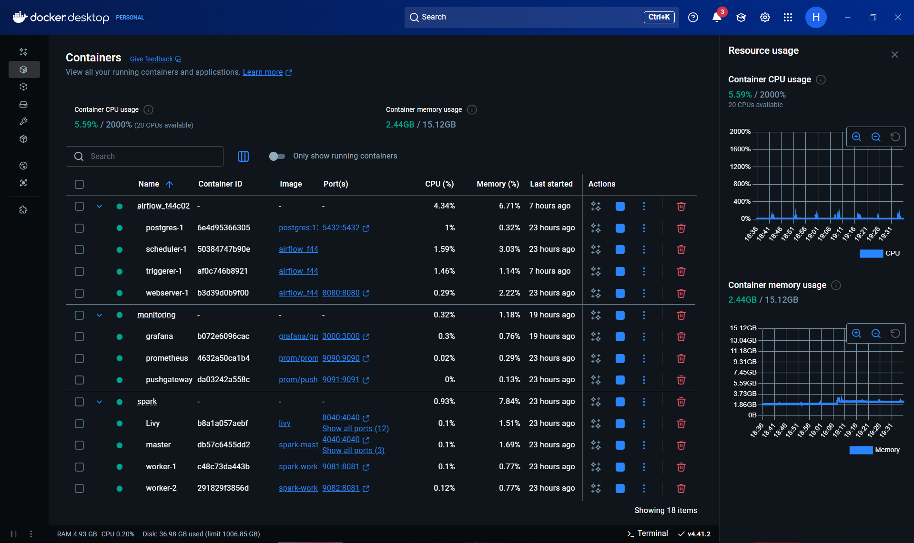
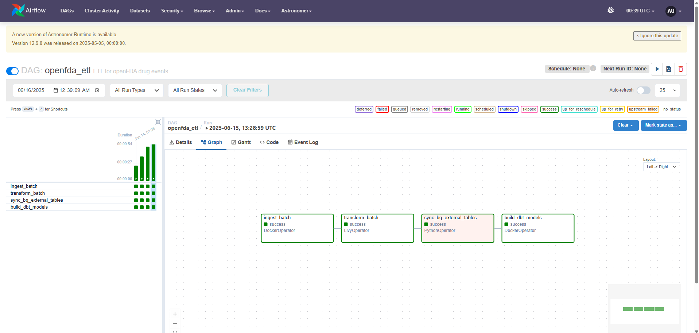
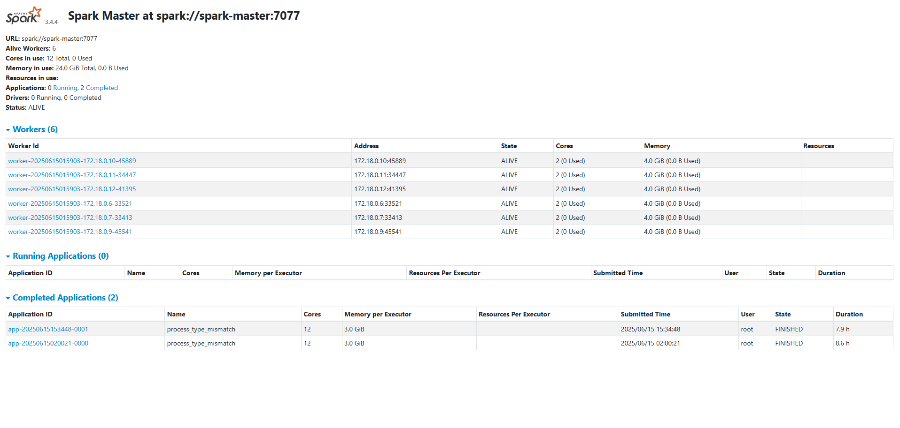
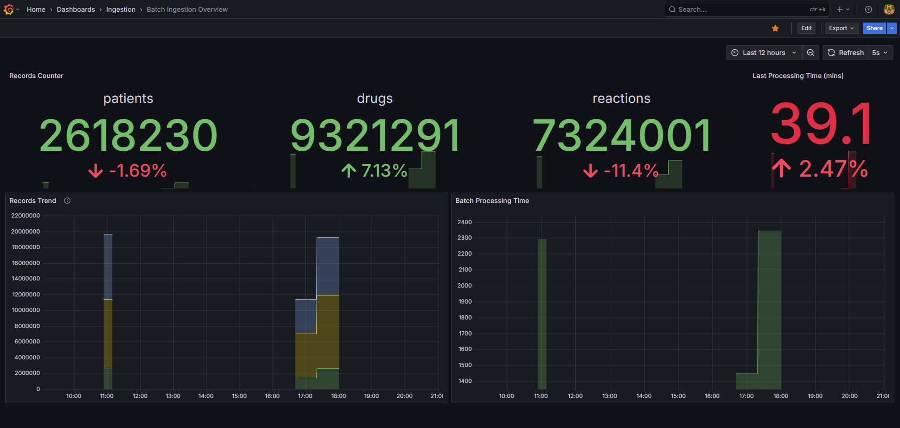
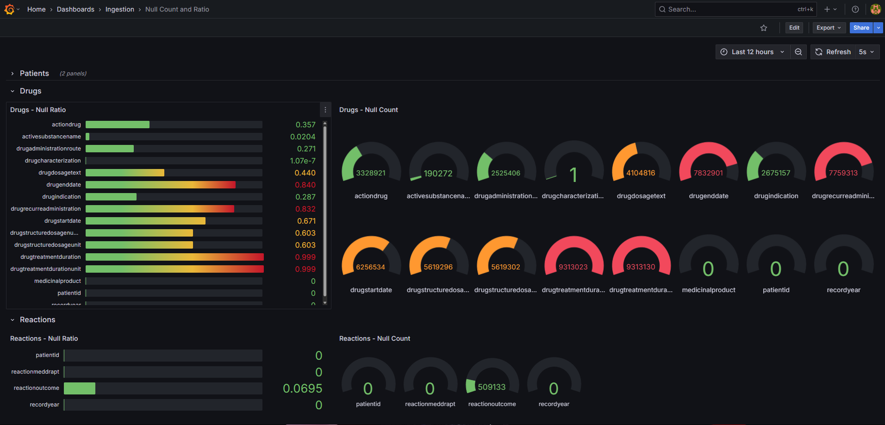
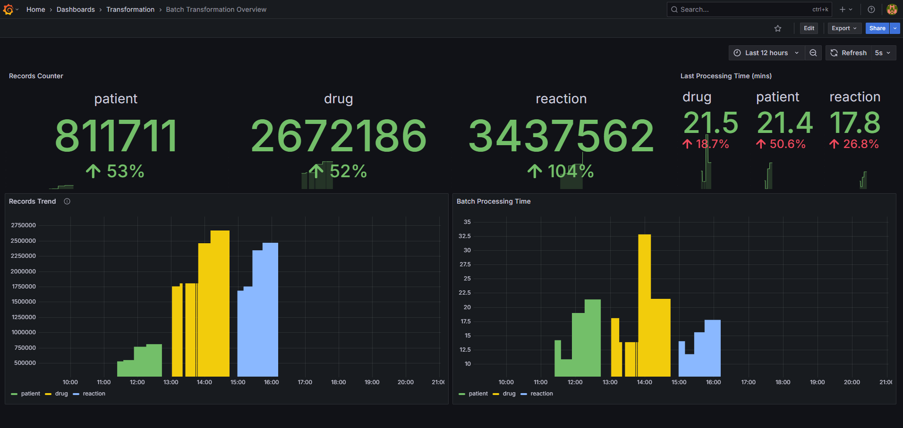
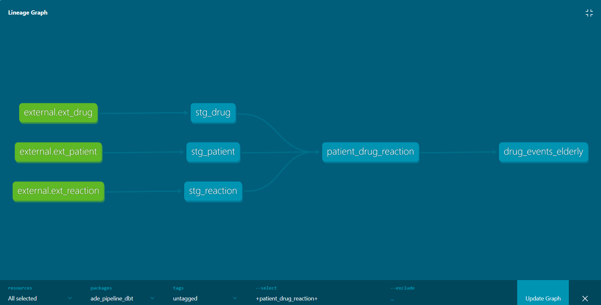
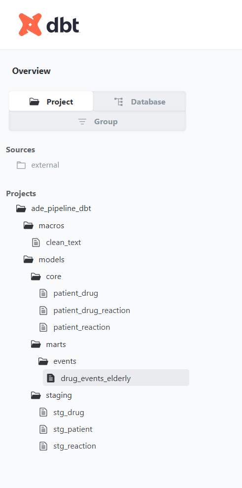
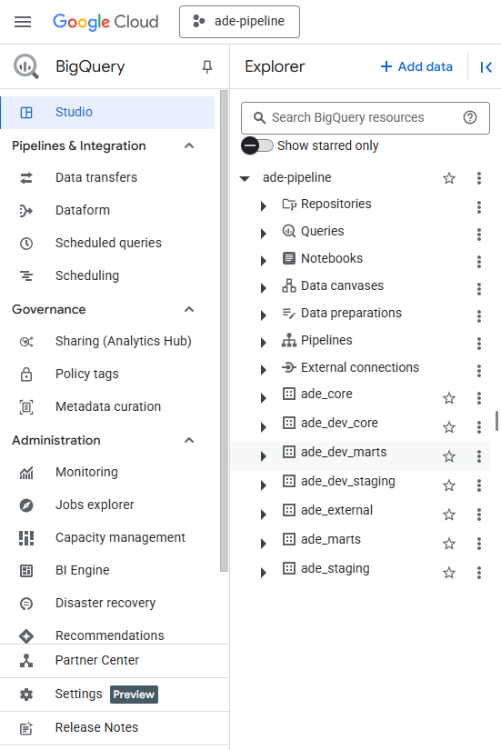

## 🧵 How Everything Fits Together

Let me walk you through the architecture and inner workings of the ADE pipeline using real artifacts from the project. Think of this as a visual storytelling tour from raw data to insights.

---

### 🧱 Laying the Foundation: System Architecture

We begin with a high-level blueprint of the system:

The pipeline processes large-scale drug safety data in stages: **ingestion**, **transformation**, **orchestration**, **analytics**, and **visualization**—each one containerized, monitored, and reproducible.

---

### 📥 Ingestion: Scalable and Memory-Aware

Ingestion is handled by a custom Python package running in lightweight Docker containers. It connects to the OpenFDA API, chunking downloads to stay within memory limits.

Each container processes data for a specific year or range, writing flattened JSON files as parquet files to **Google Cloud Storage** with hybrid metadata and pathing. The containers are spun up using Airflow DAGs.

---

### 🛠 DAGs in Action: Airflow Orchestration

Airflow (via Astronomer) orchestrates the ingestion and transformation processes.

Each DAG handles one year of data and includes tasks for:
- Ingesting data from OpenFDA.
- Submitting Spark jobs via Livy.
- Syncing BigQuery tables.
- Building DBT models.

DAGs are both scheduled and manually triggerable, enabling flexible batch operations.

---

### 🔄 Spark: Transforming Raw into Gold

Once the data is ingested, transformation happens inside a Dockerized **Spark cluster**—with one master and six workers. Jobs are submitted via Livy for remote execution.

Key transformations include:
- **Date cleanup** and format standardization.
- **Normalization** of dosage, duration, and age.
- **Categorical remapping** (e.g., outcome, gender).
- **Null and deduplication** handling.

---

### 📊 Observability: Grafana Keeps the Pulse

The pipeline is fully instrumented. Each stage pushes metrics to Prometheus, which are then visualized in Grafana dashboards.

#### 📈 Ingestion Dashboards

These show:
- Volume of data ingested.
- Processing duration.

Granular dashboards show per-file null counts:

---

#### 🔁 Transformation Dashboards

Transformation is similarly monitored:

---

### 🧱 DBT: Turning Cleaned Data into Insightful Models

DBT organizes the cleaned data into a modular SQL workflow:

Models are divided into:
- **Staging**: lightly processed external tables.
- **Core**: intermediate logic (e.g., joins, filters).
- **Marts**: analytical outputs for business questions.

---

### 🧠 BigQuery: Ready for Analysts and ML

The transformed datasets are synced to BigQuery as both external and materialized tables.

From here, stakeholders can:
- Run SQL queries.
- Connect BI tools like Looker or Data Studio.
- Perform ad hoc analysis or build predictive models.

---

### 📈 The Final Product: Grafana Dashboards

All insights culminate in **interactive Grafana dashboards** that surface medication risks, adverse events, and trends.

Dashboards allow:
- Filtering by age group or drug.
- Identifying repeat adverse reactions.
- Monitoring trends over time.

