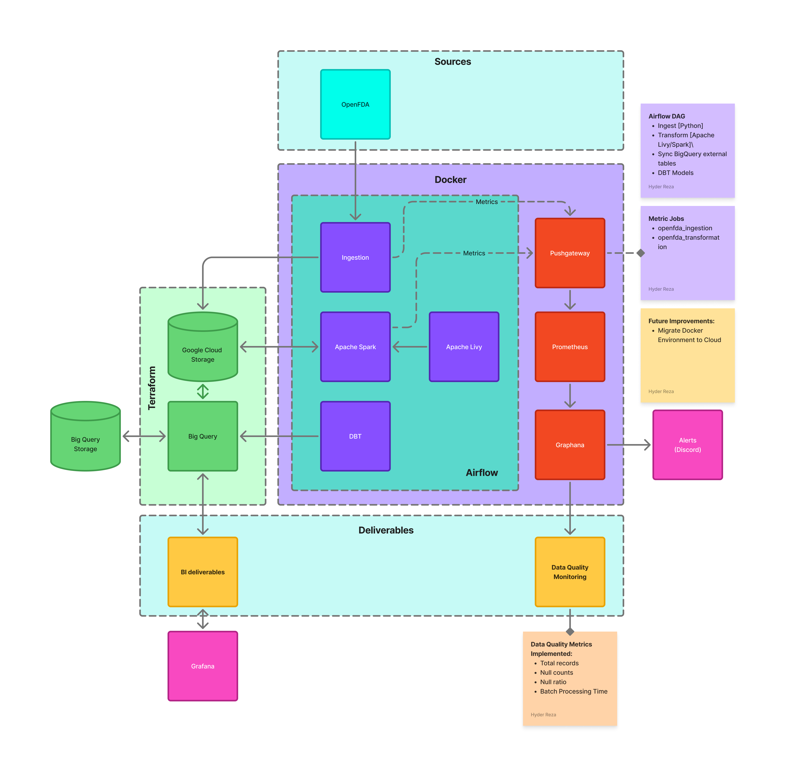
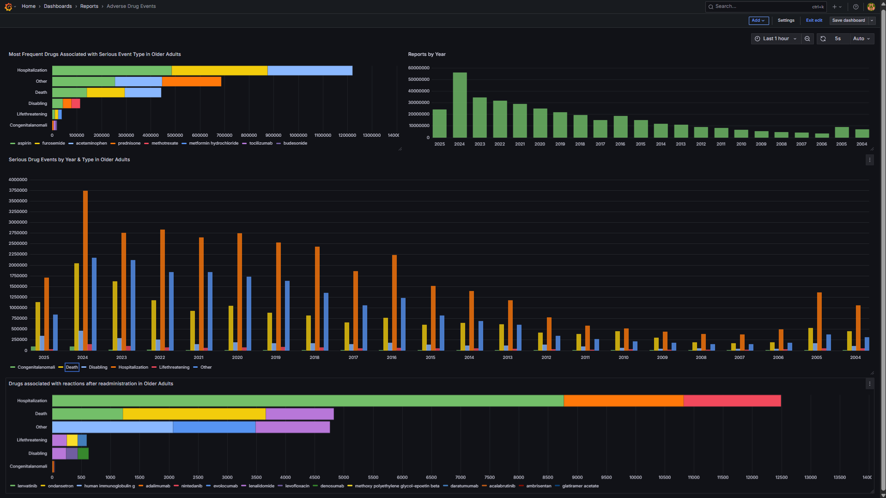

# 💊 Healthcare Data Pipeline: Medication Safety

## 📄 Summary

This project builds a scalable healthcare data pipeline to analyze over **100GB** of adverse drug event (ADE) data collected from **2004 to 2025**, focusing on elderly populations (65+). It delivers actionable insights for healthcare providers, policy makers, and researchers by uncovering high-risk medications, event trends, and drug interactions using real-world data from the FDA.

## 📌 Project Overview

The pipeline is designed to improve medication safety and optimize patient outcomes in aging populations by identifying preventable risks. It supports ingestion, transformation, orchestration, infrastructure provisioning, and analytics—all integrated for scalable, reproducible analysis.

## ✅ What the Project Does (Results & Insights)

- Processes and analyzes **100GB+** of ADE data from **2004–2025**.
- Identifies medications most associated with serious adverse events in elderly patients.
- Highlights common event types (e.g., hospitalization, death) and trends over time.
- Detects high-risk drug combinations and repeat-administration reactions.
- Provides structured, queryable data marts for analytics and dashboards.

## 🧭 Architecture Diagram

## ⚙️ How the Project Works (Technical Overview)
### 🚀 Ingestion (Python, OpenFDA API)

- Custom Python package to pull, flatten, and restructure deeply nested OpenFDA JSON data.
- Handles memory limits using chunked ingestion logic (tested in 1GB Docker containers).
- Supports ingestion of large time ranges with automated retries and logging.
- Final output: structured files stored in GCS (Google Cloud Storage).

---

### 📅 Orchestration (Airflow, Docker, Astronomer)

- Manual and scheduled DAGs for ingestion + transformation by year.
- Uses `DockerOperator` to trigger ingestion containers and mount credentials.
- Spark jobs launched via `LivyOperator` with matching parameters.
- BigQuery external tables synced via `PythonOperator`.

---

### 🔄 Transformation (Spark, Livy)

- Multi-service Spark cluster (Docker Compose): 1 master + 4 workers.
- Data normalization: dosage units (mg), age (years), treatment duration (days).
- Fixes incomplete/invalid dates, casts fields, remaps categorical values.
- Livy + REST API for Spark job submission from orchestrators.
- JupyterLab and Spark UIs exposed for debugging and monitoring.

---

### ☁️ Infrastructure (Terraform)

- Provisions:
  - Google Cloud Storage bucket with lifecycle management.
  - BigQuery datasets for structured analytics.
- Parameterized using Terraform variables for project, region, and credentials.

  ---

### 🧠 Analytical Engineering (DBT)

- 7 modular dbt models organized by:
  - **Staging**
  - **Core**
  - **Marts**
- Supports separate **dev** and **prod** environments.

---

### 📊 Visualization (Grafana)

- Dashboards highlight:
  - ADE trends over time.
  - Most reported drug reactions.
  - High-risk combinations.
  - Age-based subgroups at highest risk.

## 📈 Sample Results

- **Top 10 medications** linked to hospitalization in patients 65+.  
- **Year-over-year increase** in ADEs for specific drug classes.  
- **Repeat adverse reactions** across multiple reports.  

> 📸 Example Dashboard:

---

## ❓ Key Questions the Project Aims to Answer

- Which medications are most frequently associated with serious adverse events in patients over 65?
- What types of events (e.g., hospitalization, disability, death) are most common in older adults taking specific drugs?
- How have these trends changed from 2004 to 2025?
- Which age sub-groups (65–70, 71–80, 81+) are most at risk?
- What drug combinations are disproportionately represented in adverse event reports?
- What drugs have caused reactions after readministration?

---
